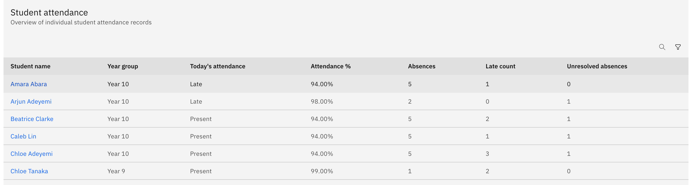
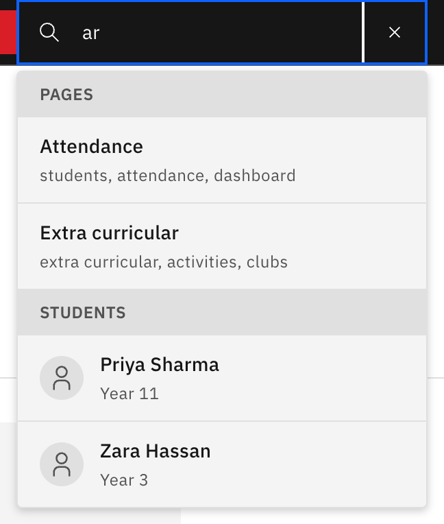

# Find and open a student profile

A student profile is the single read-only record for one student — their
details, contacts, alerts, and timetable. The quickest way in is their name,
which is a link almost everywhere it appears.

1. Click the student's name

   Find the student on any screen that lists them — a class roll, an attendance
   list, a wellbeing case, an emergency screen — and click their **name**. The
   profile opens at the **At a glance** tab. The same profile opens wherever you
   click from; the starting screen only sets the breadcrumb back-link, so opening
   from a class roll lets that trail return you to the roll.

   

2. Or search by name

   Open the **search** in the top toolbar and type at least **2 characters** of
   the student's name. Results appear after a short pause as you type, split into
   **Pages** (places in the app) and **Students**. Click the student row to open
   their profile. Searching for students needs search access — without it, the
   students section simply doesn't appear.

   

3. Confirm you're on the right student

   The profile header shows the student's **name**, with their **Student ID**,
   **House** and **Enrolment status** as inline attributes. Everything here is
   read-only — you view and copy, you don't edit a student's record from this
   page.
