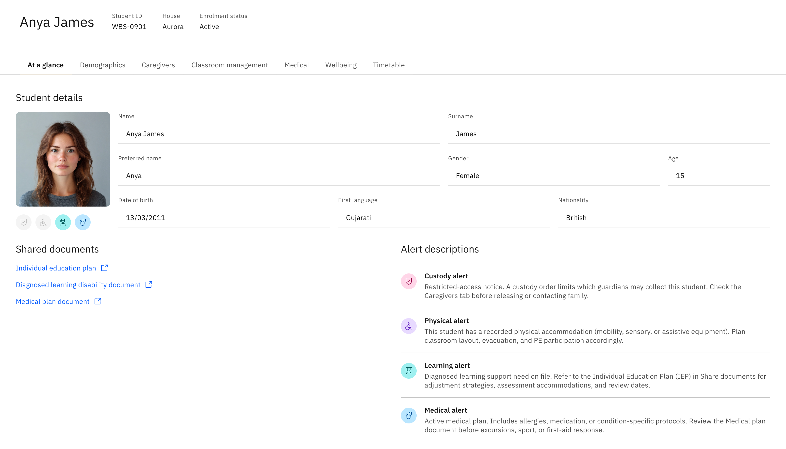

# View a student at a glance

**At a glance** is the landing tab of a student's profile — their photo and core
details, a row of alert icons, and any shared documents. Everything here is
read-only: you view and copy, you never edit a student's record.

1. Open the profile

   Click a **student's name** anywhere it appears — a class roll, an attendance
   list, a wellbeing case — or search the name in the header search and pick the
   student. The profile opens on **At a glance**. Opening it needs
   student-profile read access.

   

2. Read the student's details

   The **Student details** block shows the photo (or a placeholder) and the core
   identity fields: **Name**, **Surname**, **Preferred name**, **Gender**,
   **Age**, **Date of birth**, **First language**, and **Nationality**. An empty
   field shows a dash (**—**) — that's normal, not an error.

3. Check the alert icons

   Over the photo is a row of four coloured icons, always in the same order:
   **Custody**, **Physical**, **Learning**, **Medical**. A **full-colour** icon
   means that alert is active for this student; a **muted/greyed** icon means it's
   not on file. The icons stay in place even when inactive, so the row reads the
   same for every student. Whether an alert shows depends on the student's data,
   not on your role.

   - **Custody** — a custody order limits who may collect the student.
   - **Physical** — a recorded physical accommodation (mobility, sensory,
     assistive equipment).
   - **Learning** — a diagnosed learning-support need; refer to the IEP.
   - **Medical** — an active medical plan (allergies, medication, condition
     protocols).

4. Open an active alert for detail

   **Click an active icon** to open a short pop-up explaining it. Where relevant
   the pop-up links you on: **Custody** opens the **Caregivers** tab so you can
   check who may collect the student before releasing them; **Learning** links the
   IEP and learning-disability documents; **Medical** points to the Medical plan
   and Wellbeing tab. The **Physical** pop-up shows a general note only. Muted
   (inactive) icons are not clickable.

   > **Note:** Before releasing a student to anyone, follow an active **Custody**
   > alert through to the **Caregivers** tab and confirm the person is authorised
   > to collect them.

5. Open shared documents

   **Shared documents** lists any **Individual education plan (IEP)**, **diagnosed
   learning disability**, or **medical plan** document attached to the student —
   click one to view or download it. If nothing is attached, the section says so.

6. Use the alert key

   **Alert descriptions** at the bottom is a static key explaining all four alert
   types, so you can read the row even when you're new to it.
