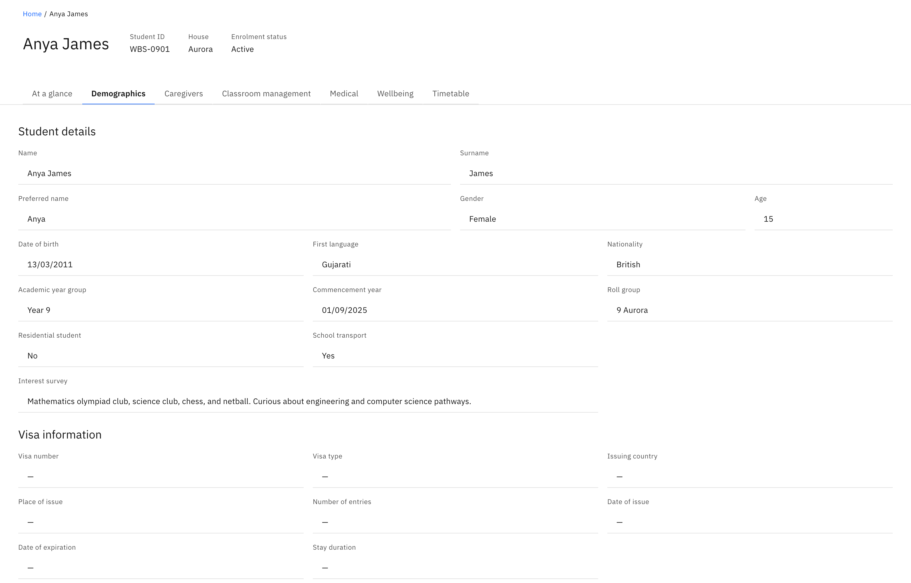
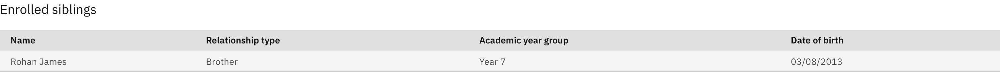

# View a student's demographics

The **Demographics** tab holds a student's fuller identity record — residency,
transport, visa details, and any siblings enrolled at the school. Everything is
read-only: you view and copy, you don't edit a student's record here.

1. Open the Demographics tab

   On a student profile, open the **Demographics** tab. It sits alongside the
   other profile tabs.

   

2. Read Student details

   The **Student details** block covers identity and enrolment: **Name**,
   **Surname**, **Preferred name**, **Gender**, **Age**, **Date of birth**,
   **First language**, **Nationality**, **Academic year group**, **Commencement
   year**, **Roll group**, **Residential student** (Yes/No), **School transport**
   (Yes/No), and **Interest survey**.

3. Read Visa information

   The **Visa information** block lists **Visa number**, **Visa type**, **Issuing
   country**, **Place of issue**, **Number of entries**, **Date of issue**, **Date
   of expiration**, and **Stay duration**. **Visa remarks** only show when there
   are remarks on file.

4. Check Enrolled siblings

   The **Enrolled siblings** table lists each sibling at the school with their
   **Name**, **Relationship type**, **Academic year group**, and **Date of
   birth**. If the student has none, it shows **No enrolled siblings**.

   

   Any field with no value shows a dash (**—**) — this is normal, not an error.
