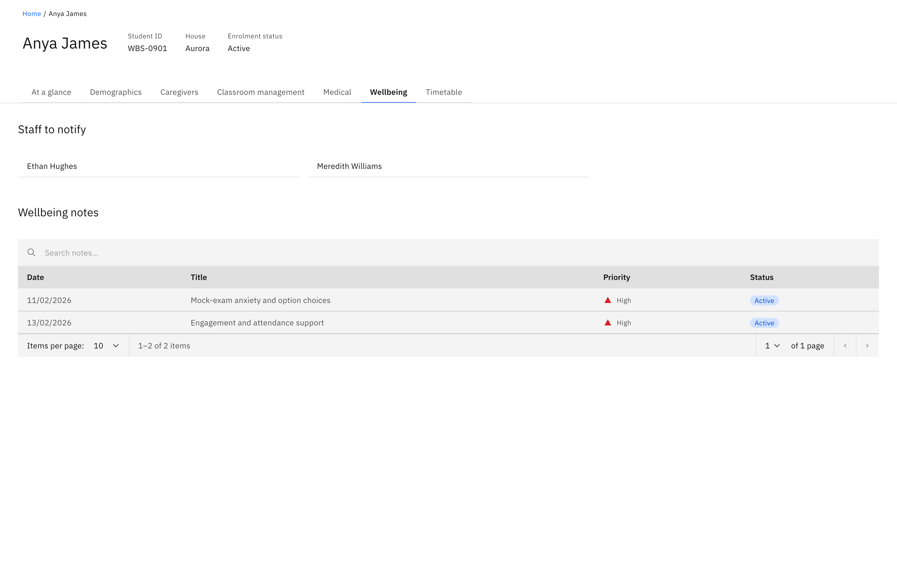
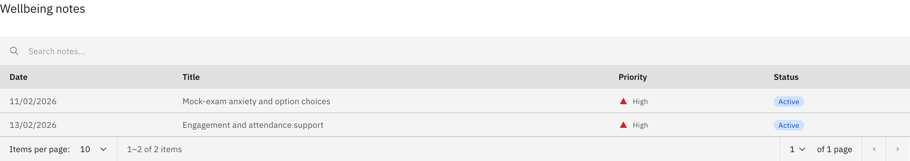

# View wellbeing notes

The **Wellbeing** tab on a student profile gathers every wellbeing note raised
for that student, plus the contacts to escalate to. Like the rest of the
profile, it is read-only — you view and copy here, you don't raise or manage a
case from this page.

1. Open the Wellbeing tab

   On the student profile, click the **Wellbeing** tab.

   

2. Check who to notify

   **Staff to notify** lists the escalation contacts for this student. If no
   one is set, it reads **No staff to notify**.

3. Read the wellbeing notes

   **Wellbeing notes** is a searchable table of every note raised for the
   student. Each row shows the **Date**, the **Title**, the **Priority** (Low,
   Medium, High or Critical, shown as an icon) and the **Status** of the
   wellbeing case (shown as a coloured tag). Type in the search box to filter,
   and set how many rows show per page — 10, 25, 50 or 100. When there are no
   notes the table reads **No wellbeing notes yet**.

   

   This table only shows notes. To raise a note or manage a case, work in the
   Wellbeing feature rather than here.
