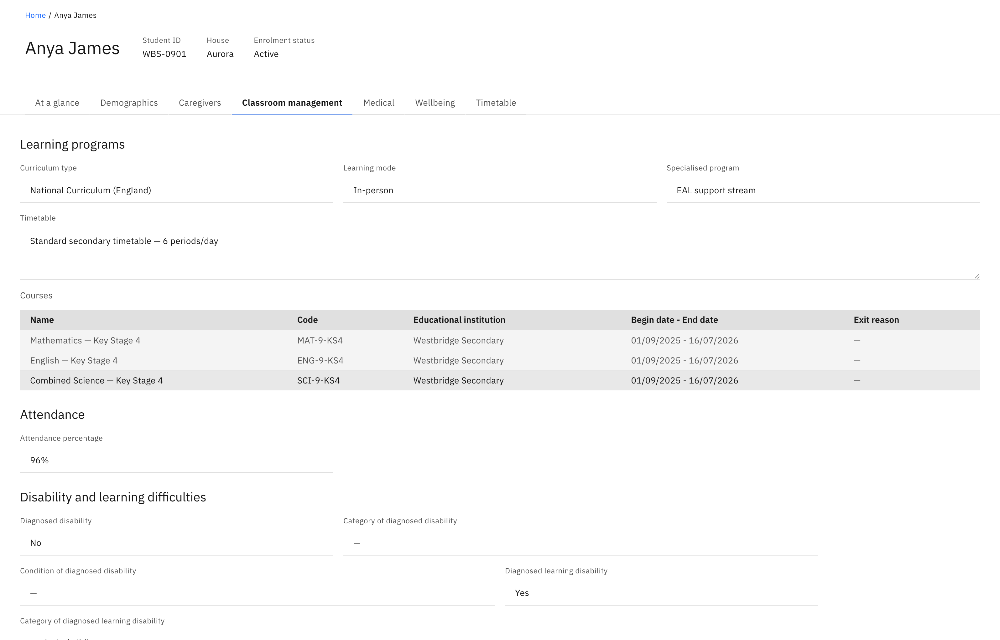
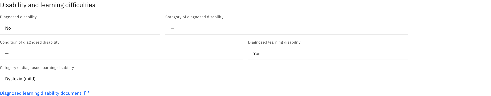

# View classroom & learning

The **Classroom management** tab gathers a student's learning programme, the
courses they're enrolled in, their overall attendance, and any diagnosed
disability or learning difficulty. Like the rest of the profile, it's read-only
— you view and copy, you don't edit here.

1. Open the Classroom management tab

   On a student profile, open the **Classroom management** tab.

   

2. Read the learning programme

   **Learning programs** shows the **Curriculum type**, **Learning mode**,
   **Specialised program**, and a free-text **Timetable**. Below them, the
   **Courses** table lists each course with its **Name**, **Code**,
   **Educational institution**, **Begin date – End date**, and **Exit reason**.
   The table reads **No courses** when the student has none enrolled.

3. Check attendance

   **Attendance** shows the student's overall **Attendance percentage**.

4. Read disability and learning difficulty detail

   **Disability and learning difficulties** records **Diagnosed disability**
   (Yes/No) with its **Category** and **Condition**, and **Diagnosed learning
   disability** (Yes/No) with its **Category**. Where a **diagnosed learning
   disability document** is on file, a link to it appears here; otherwise the
   section shows a "none attached" line. Any field with no value shows a dash
   (**—**) — that's normal, not an error.

   
