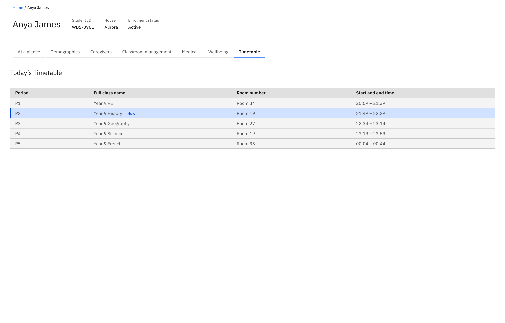

# View a student's timetable

See what a student has on today — the day's classes, where they are, and what
they're in right now. The timetable is read-only, like the rest of the profile.

1. Open the Timetable tab

   On the student's profile, open the **Timetable** tab. It opens to
   **Today's Timetable**, the list of classes scheduled for the current day.

2. Read the day's classes

   Each row shows the **Period**, **Full class name**, **Room number**, and
   **Start and end time**. Any field with no value shows a dash. If the student
   has no classes scheduled, the tab shows a "nothing scheduled" message instead
   of a list.

   

3. Spot the class happening now

   The class in progress is tagged **Now** — a blue tag next to the class name —
   worked out from the current time against each class's start and end time, so
   it's an at-a-glance answer to where the student should be right now.
