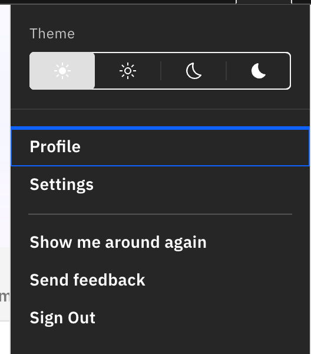
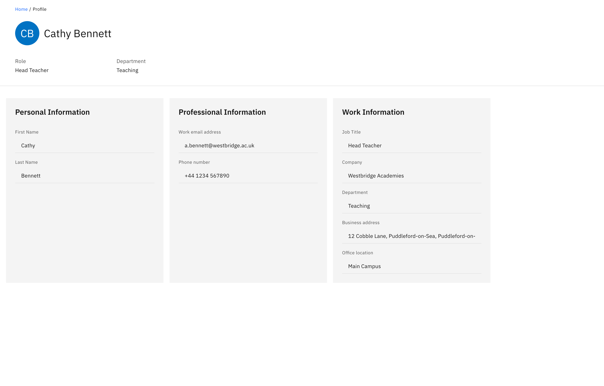

# View your own profile

Your profile page is a read-only view of your own staff account — name, role,
contact and work details. It is reached from the user menu only and is separate
from any student profile.

1. Open the user menu

   Click your **avatar** in the top-right corner.

2. Click Profile

   Choose **Profile** from the menu. The page opens showing your avatar and
   name, with **Role** and **Department** as header attributes.

   

3. Read your details

   Below the header, three cards list what your organisation has on file:

   - **Personal Information** — First name, Last name, Pronouns, Birthday.
   - **Professional Information** — Work email address, Phone number.
   - **Work Information** — Job title, Company, Department, Business address,
     Office location.

   Only fields that have a value are shown within a card; a card with nothing on
   file shows **Not provided**.

   

4. Editing your details

   Everything here is read-only — this is a view of your account, not an editor.
   Profile data comes from your organisation's directory, so to change a detail,
   ask whoever manages your directory account.
