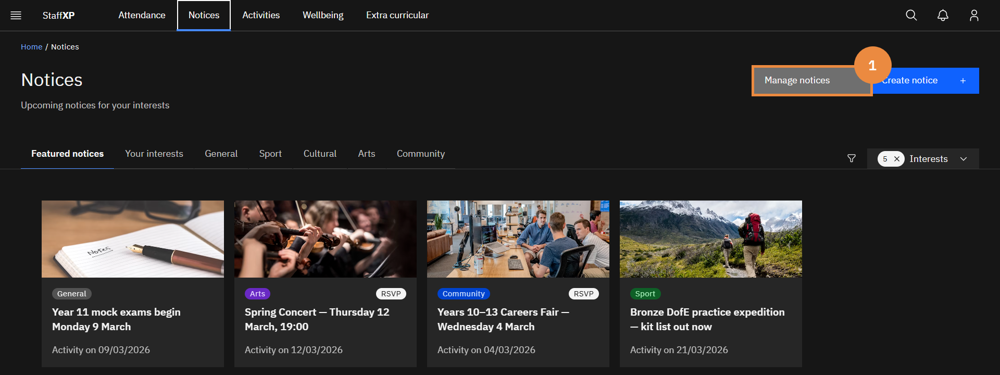
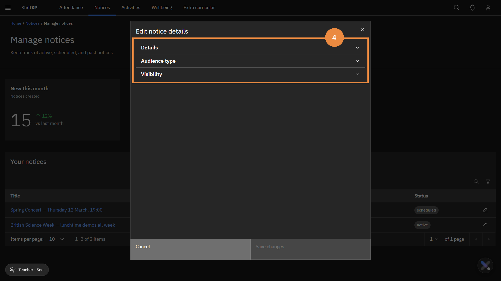
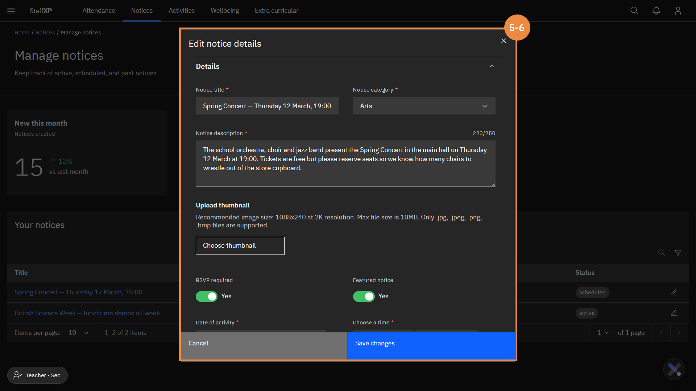

### Edit a notice

> **Note:** *You can only edit a notice that you have created.*

1. In the **Notices** tab, click **Manage notices**.
2. Find the notice you want to edit.
> **Note:** *You can filter your notices via the **Active notices** and **Scheduled notices** tile.*
3. Click **edit icon**.
4. Expand the appropriate sections to edit the notice.
5. Make the edits as needed.
6. Click **Save changes**.

