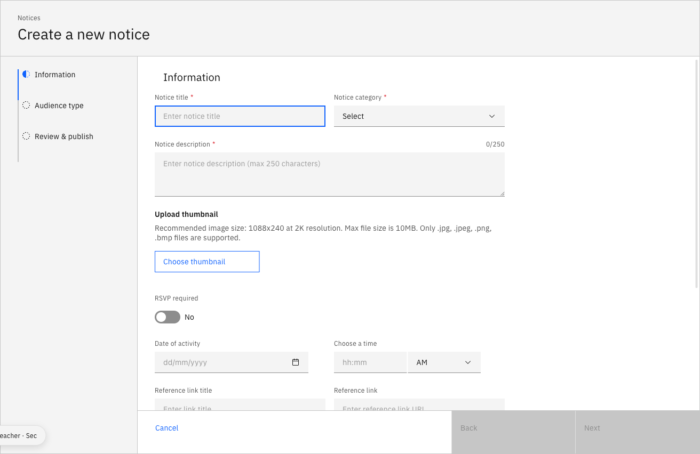

---
summary:
  - "Open **Notices** and click **Create notice +**."
  - "Fill in the **Notice details**, then set the **Audience** and **Visibility**."
  - "Check the **Review and Publish** tab, then click **Publish**."
keywords: [create notice, post a notice, new notice, make an announcement, publish notice, send notice to parents, notify staff]
video:
  youtube:
  bunny:
---

# Create a notice

Notices are announcements you publish to staff, parents, and/or students.
Creating one is a short wizard: enter the details, choose the audience, set the
visibility window, then review and publish.

1. Open the notice form

   Click **Notices** in the navigation bar, then click **Create notice +** in the
   top-right corner.

   

2. Fill in the notice details

   Complete the **Notice details** in the pop-up window:

   - A **Notice title**
   - The **Notice category** (from the dropdown)
   - A **Notice description**
   - *Optional:* a thumbnail image, whether an **RSVP** is required, the date and
     time, a **Reference link title** and **Reference link**, and a supporting document

   Then click **Next**.

   > **Note:** Thumbnail images and supporting documents must meet the accepted
   > file size and format.

   

3. Choose the audience

   In the **Audience type** section, select who can see the notice — **Staff**,
   **Parents**, or **Students**. Under **Select staff**, pick the relevant staff,
   and under **Year groups**, choose the year groups it applies to. Click **Next**.

   > **Note:** If the notice is going to parents, make sure it complies with your
   > school's communication guidelines.

   

4. Set the visibility

   In the **Visibility** tab, fill in the **From** and **Until** fields — the
   notice is visible to your audience during this window. Choose whether it should
   repeat, then click **Next**.

   

5. Review and publish

   In the **Review and Publish** tab, check the details and tone. To change
   anything, click **Back**. When everything is correct, click **Publish**.

   
